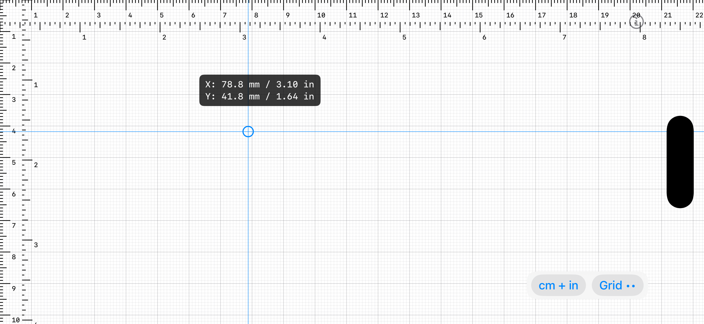

# Ruler (iOS)

An on-screen ruler for iPhone and iPad. Hold a physical object against the
screen and read its size off the ruler — in centimeters, inches, or both.

This is the iOS/iPadOS port of the macOS [RulerApp](https://github.com/MatRanc/RulerApp).
A single universal app runs on both iPhone and iPad.



## Build & run

```
brew install xcodegen   # one-time, if you don't have it
xcodegen generate
open RulerApp.xcodeproj
```

Then ⌘R in Xcode (pick an iPhone or iPad simulator, or your device).

## Using it

- **Drag** anywhere to drop a crosshair; the badge shows the X/Y distance from
  the top-left corner. The crosshair stays put when you lift your finger so you
  can read it. On iPad you can also hover with a trackpad pointer or Apple Pencil.
- **cm / in / cm + in** button — cycle the unit.
- **Grid** button — cycle the grid: off → major → major + minor.
- On an iPad with a hardware keyboard, **U** cycles the unit and **G** the grid.
- **ⓘ** (top-right) — About, version, and feedback.

## Accuracy & calibration

There is **no manual calibration**. The ruler's scale is derived from the
device's known physical pixel density: `DeviceModel` maps the hardware model
identifier to its PPI, and `DisplayMetrics` converts that to points-per-mm using
`UIScreen.nativeScale` (which correctly handles the downsampled "Plus"/"mini"
panels). Because every iPhone/iPad model is known, this is accurate out of the
box. Unrecognized future models fall back to a sensible default until added to
the table in `DeviceModel.swift`.

The ruler fills the entire screen so its origin is the true top-left pixel. Note
that on devices with rounded corners or a notch/Dynamic Island, the very edges of
the screen are physically clipped — measure from a flat edge for best results.

## Project layout

- `Sources/RulerApp/RulerAppApp.swift` — SwiftUI `App` entry point.
- `Sources/RulerApp/ContentView.swift` — root screen, controls, About sheet.
- `Sources/RulerApp/RulerView.swift` — the ruler canvas + crosshair.
- `Sources/RulerApp/RulerState.swift`, `RulerUnit.swift` — state and units.
- `Sources/RulerApp/DeviceModel.swift`, `DisplayMetrics.swift` — physical scale.
- `Sources/RulerApp/AboutView.swift` — About sheet.
- `project.yml` — XcodeGen project definition (universal iOS app, iOS 16+).
